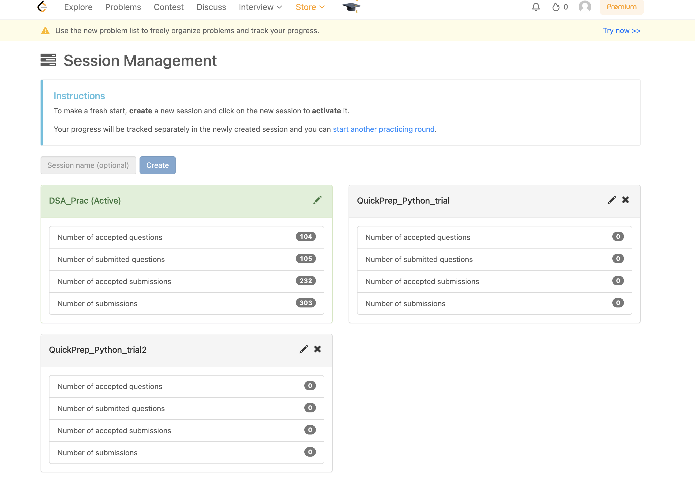

# Leetcode Session Creator

Recently, Leetcode made changes to their platform, deprecating the ability to create new sessions directly from the UI. The "Create New Session" button is now unclickable, preventing users from organizing their coding sessions the way they used to.

This script was developed to solve that problem by programmatically creating new sessions on Leetcode. By leveraging Leetcode's existing session-handling system, this script allows users to bypass the interface limitation and generate new sessions as needed.

The primary goal of this script is to provide a seamless way for developers to continue managing their coding sessions, despite the recent UI changes. It uses Leetcode's session cookies and CSRF tokens to send a valid request to the backend and create a new session automatically.

If you’re missing the flexibility of organizing your work with Leetcode sessions, this script is a reliable workaround to regain that functionality.


## 📋 How to Use

1. **Clone the Repository**:
   ```bash
   git clone <repository-url>
   cd <repository-name>
   ```

2. **Ensure Node.js is Installed**:  
   Make sure you have [Node.js](https://nodejs.org/) installed on your machine.

3. **Edit the `config.json` File**:  
   Open the `config.json` file in your preferred code editor and follow these steps:
   - Enter your Leetcode session token under `LEETCODE_SESSION`.
   - Enter your Leetcode CSRF token under `CSRF_TOKEN`.
   - Set `NEW_SESSION_NAME` to the desired name for your new session.

4. **Run the Script**:
   Open your terminal and navigate to the project folder. Run the following command:
   ```bash
   node node LC_session_builder.js
   ```

5. **Enjoy**:  
   Your new session will be created!!!

### ⚠️ Warning:
Occasionally, Leetcode servers might reject the request with a `403 Forbidden` status (likely due to Load Balancer or server-side changes). To mitigate this, the script includes a retry mechanism that continues attempting the request until it succeeds with a `200 OK` response.

> **Note**: This script uses a deprecated method for creating sessions. Over time, Leetcode may completely remove support for this, and the script will stop working.

---

## 🛠 How to Get Your Leetcode Session and CSRF Token

1. **Open Leetcode in Your Browser**.
2. **Right-click on the page** and select **Inspect**.
3. Go to the **Application** tab in the Inspect window.
4. Find the **Cookies** section on the left-hand side.
5. Locate and copy the values for `LEETCODE_SESSION` and `csrftoken`.


---

## 📄 Disclaimer

This script is **not** an official API, and Leetcode may change its session-handling mechanisms at any time. Use this script at your own risk. It could stop working if Leetcode removes or modifies this endpoint, rate-limits it, or applies any other server-side changes.

If this script stops working, it’s likely due to these changes, and unfortunately, there's nothing we can do to fix it at that point.
